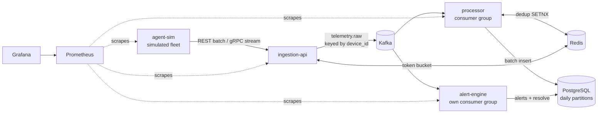

  

&nbsp;

---

### Now

- **Building [`device-telemetry-platform`](https://github.com/k28611-nits/device-telemetry-platform)** — a Go + Kafka telemetry & alerting pipeline with per-device ordering, idempotent at-least-once delivery, and time-partitioned PostgreSQL.
- **Shipped [World Cup Unbeaten](https://world-cup-unbeaten.pages.dev/)** — a football World Cup draft simulator I built and deployed end to end for fun.
- **Sharpening:** distributed-systems design — streaming, backpressure, and Kubernetes operations.

---

### Featured work

**[device-telemetry-platform](https://github.com/k28611-nits/device-telemetry-platform)** &nbsp;·&nbsp; `Go · gRPC · Kafka · Redis · PostgreSQL · Docker · Kubernetes · Prometheus · Grafana`

A horizontally scalable device-telemetry pipeline. Simulated agent fleets stream CPU / memory / disk / network / heartbeat metrics over **REST and gRPC** into a **Kafka** backbone keyed by device ID, deduplicated through **Redis** and landed in **time-partitioned PostgreSQL**; an independent consumer group evaluates threshold rules in-stream and fires alerts, with **Prometheus / Grafana** across every stage.

> The point is the pipeline, not the CRUD — backpressure under burst, at-least-once delivery made safe by idempotency, per-device ordering, and retention that never rewrites rows.

<b>Architecture</b> — four Go services, one topic, one database

**[World Cup Unbeaten](https://world-cup-unbeaten.pages.dev/)** &nbsp;·&nbsp; `JavaScript · Vite · Cloudflare Pages`

A browser-based **football World Cup draft simulator** — draft a squad and see how far an unbeaten run through the tournament takes you. A side project, built and deployed end to end.

**Where it started** &nbsp;·&nbsp; college roots, kept honest:

- **[Leetcode-Solutions](https://github.com/k28611-nits/Leetcode-Solutions)** `C++` — a curated set from 500+ problems solved; the DSA groundwork under everything above.
- **[Weather-App](https://github.com/k28611-nits/Weather-App)** `JavaScript` — a real-time weather app; one of the first things I shipped end to end.

---

### Tech stack

| Domain | Tools |
|---|---|
| **Languages** | Go · C# · C++ · C |
| **Backend & APIs** | Goroutines & concurrency · C# threading · gRPC · REST |
| **Distributed & data** | Kafka · Redis · PostgreSQL · MongoDB · SQLite |
| **Platform & ops** | Docker · Kubernetes · Prometheus · Grafana · GitHub Actions CI/CD |

 

---

### Experience

**Senior Software Engineer** · Backend · Bengaluru, India

I design and build distributed backend services and systems software in **Go and C#** — concurrency-heavy pipelines, gRPC / REST APIs, and the databases and infrastructure behind them, from design through release. Along the way I mentor engineers, review a lot of pull requests, and have conducted **25+ technical interviews**.

**B.Tech, Electronics & Communication Engineering** · NIT Silchar · 2019 – 2023

More on <a href="https://www.linkedin.com/in/kushagra-kumar-86b013124/">LinkedIn</a>.

---

### Player stats

---

### Beyond code

Off the clock: geopolitics · cricket · Formula 1 · reading physics. (And yes, that's me clearing the car. Every lap.)

---

### Let's talk

Building something in backend, distributed systems, or platform engineering? I'd like to hear about it — coffee's on me.

**[kushagra1601sde@gmail.com](mailto:kushagra1601sde@gmail.com)** &nbsp;·&nbsp; **[LinkedIn](https://www.linkedin.com/in/kushagra-kumar-86b013124/)** &nbsp;·&nbsp; **[LeetCode](https://leetcode.com/kushagra1601/)**

<!--
  MAINTENANCE — update in under 5 minutes:
  - "Now": edit the 3 bullets in the ### Now section. Keep it to what's true this month.
  - "Featured work": the lead project lives under ### Featured work. To swap it, change the
    title/link, the one-paragraph description, the backtick stack line, and the mermaid block.
  - THEMING: each SVG self-themes via an internal <style> with CSS variables and
    @media (prefers-color-scheme: dark). Light values live in :root, dark overrides
    in the media block. On github.com the images follow your GitHub appearance
    setting; in local previews they follow the OS/app theme.
  - assets/stats.svg — "Player stats" card (values are <text> elements).
  - assets/header.svg — hero; sun+cloud show in light, moon+stars in dark
    (the .only-light / .only-dark classes control this).
  - assets/hello.svg — two-frame pixel sprite wave (frames base64-embedded).
    GitHub profile pic: assets/pixel-avatar.png. Coffee sprite: assets/coffee-sprite.png.
  - assets/interests.svg — sprite doing each hobby + the car-jump. The jump is TIMED
    to the car: both run on a 4.6s loop — if you change the car's dur, retune the
    jumper's keyTimes.
  - Accent color is teal: #2dd4bf (dark) / #0d9488 (light). Reuse it for any new badge/SVG.
  - resume.pdf is gitignored — never commit it. Run `git status` before every commit.
-->
